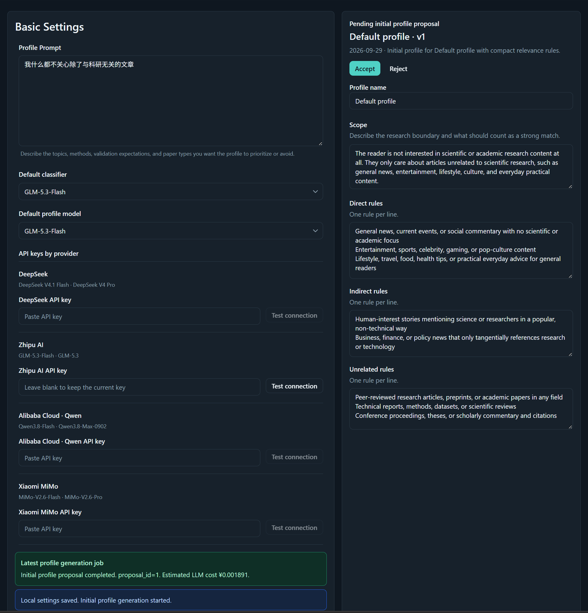
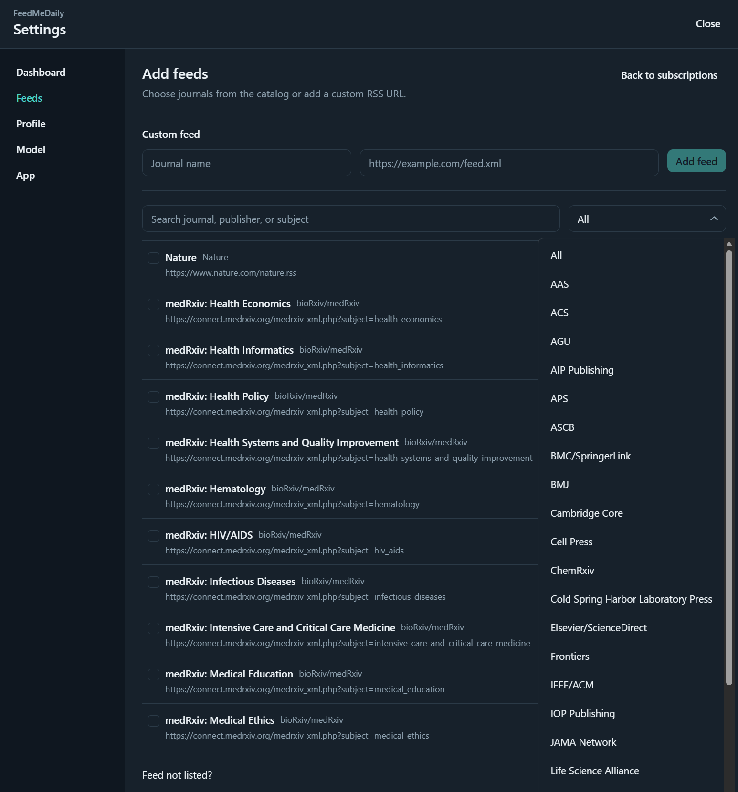
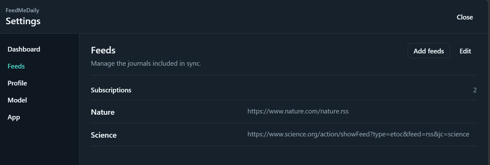
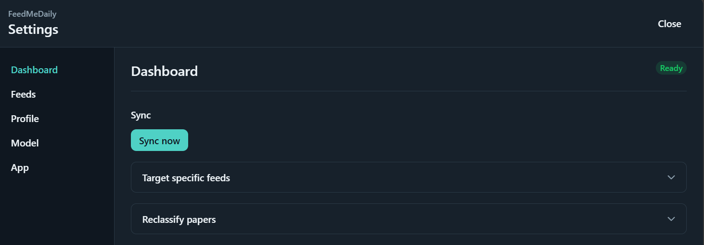
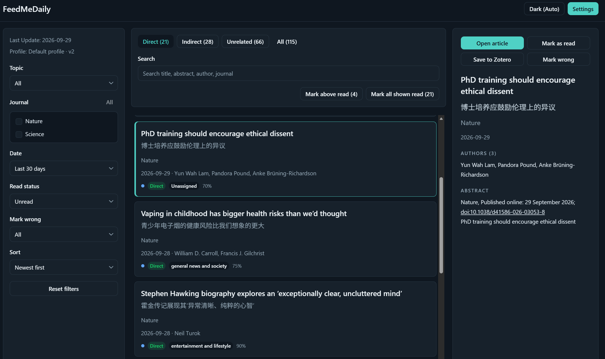

# FeedMeDaily


FeedMeDaily 是一个面向科研 RSS 的本地论文筛选工具。它可以抓取期刊 RSS、按兴趣清单（Profile）规则调用 LLM 做相关性分类、提供本地 Web 界面进行阅读和反馈，并支持把选中的论文保存到 Zotero。

- 当前架构说明见 [ARCHITECTURE.md](./ARCHITECTURE.md)
- 中文维护与开发手册见 [docs/maintenance-development.zh-CN.md](./docs/maintenance-development.zh-CN.md)
- 本地 API 文档见 [docs/api.zh-CN.md](./docs/api.zh-CN.md)
- 版本更新记录见 [CHANGELOG.md](./CHANGELOG.md)
- 开源协议为 [MIT](./LICENSE)

## 快速开始

### 安装

FeedMeDaily 当前只提供 Windows 安装版。请从 GitHub Releases 下载最新版安装包：

- [FeedMeDaily Releases](https://github.com/yyngfive/feedmedaily/releases/latest)

安装完成页默认勾选“启动托盘并打开 Web UI”。之后双击桌面图标：托盘未运行时启动托盘，已运行时打开网页；也可以通过托盘图标打开界面。

首次使用需要填写兴趣描述、录入对应 API key 并选择分类模型。如果使用 Zotero，还可以接入自己的 Zotero 账户。全部设置完成后可以生成初始 Profile（Save and Generate）。

### Profile

可以使用中文或英文描述自己感兴趣的研究内容以及明确不感兴趣的研究内容。这些内容最终会被AI解析为三种规则（与你的兴趣直接相关：direct，间接相关：indirect和不相关：unrelated）

### 模型设置

分类和 Profile 模型均使用各供应商官方的 OpenAI 兼容 API。录入对应 API Key 即可启用该供应商的模型

支持的供应商的 API Key 获取方式：

#### DeepSeek V4.1 Flash 和 V4 Pro

1. 在 [DeepSeek Platform](https://platform.deepseek.com/) 注册并登录
2. 在 [API Keys](https://platform.deepseek.com/api_keys) 页面创建 API Key

#### GLM-5.3-Flash 和 GLM-5.3

1. 在 [智谱 BigModel 开放平台](https://open.bigmodel.cn/) 注册并登录
2. 在 [API Keys](https://bigmodel.cn/usercenter/proj-mgmt/apikeys) 页面创建 API Key

#### Qwen3.8-Flash 和 Qwen3.8-Max-0902

1. 在 [阿里云百炼控制台](https://bailian.console.aliyun.com/) 注册并登录
2. 按照[获取与配置 API Key](https://help.aliyun.com/zh/model-studio/get-api-key/)的指引创建 API Key；本应用固定使用中国大陆百炼端点，国际版 Key 无法使用

#### MiMo-V2.6-Flash 和 MiMo-V2.6-Pro

1. 在 [小米 MiMo API 开放平台](https://mimo.mi.com/) 注册并登录
2. 在控制台的 API Keys 页面申请按量付费 API Key

### Zotero 设置

- 可以在初始界面的高级设置或者主界面的App设置界面设置Zotero。设置后可以直接在FMD应用内将感兴趣的文章保存到Zotero
- 个人库：`ZOTERO_LIBRARY_TYPE=user`，`ZOTERO_LIBRARY_ID` 填写 Zotero的 `userID`
- 群组库：`ZOTERO_LIBRARY_TYPE=group`，`ZOTERO_LIBRARY_ID` 填对应 `groupID`
- `ZOTERO_COLLECTION_KEY` 可留空，表示每次保存时在应用内选择 collection

API Key和Zotero ID可通过下方链接获取：

- [Zotero Web API Basics](https://www.zotero.org/support/dev/web_api/v3/basics)
- [Zotero API Keys](https://www.zotero.org/settings/keys)

点击Save Settings可以保存所有设置

### 确认Profile

生成的初始Profile可以再次编辑，确认后点击Accept接受当前Profile



### 订阅期刊

FMD通过各出版社提供了官方RSS来追踪最新的文献。FMD内置了1000多种各领域的常见期刊的RSS地址，也可以自行录入。

进入主界面后，在Settings的Feed页面，点击Add Feeds可以添加订阅。勾选需要的期刊后可以添加并保存





### 开启同步

在Settings的Dashboard页面点击Sync即可从订阅的RSS地址中获取最新一期文章并分类。Sync过程中可能会弹出“人类验证”的提示窗口，等待自行关闭或者手动点击“我是人类”后关闭。FMD默认开启每天上午九点定时Sync，可以在App设置页修改时间或关闭。如果使用DeepSeek模型，建议设置在谷价时段。



建议同步周期不超过出版社的期刊在线发表或纸质版出版周期。出版社的RSS地址仅提供最新一期或最新的提前预览文章。Sync间隔时间过长可能导致部分文章无法被FMD记录。

FMD只能记录RSS订阅来源的文章，追踪特定期刊的新文章，检索范围仅限Sync功能记录的文章。

### 查看文章

在主界面可以查看完成分类的文章、将文章标记为已读、保存文章到Zotero、打开原文链接或者分类筛选



### 其他

FMD的其他功能请自行探索

## 开发者

### 开发环境

- Go
- Node.js
- pnpm
- Windows（只测试了Windows）

### 获取源码

```powershell
git clone git@github.com:yyngfive/feedmedaily.git
cd feedmedaily
```

### 配置并运行 source mode

先复制本地配置模板：

```powershell
Copy-Item .env.example .env
```

安装前端依赖并构建：

```powershell
pnpm --dir web install
pnpm --dir web build
```

启动托盘程序：

```powershell
go run .\cmd\feedmedaily-tray --root .
```

直接启动后端服务可以自动拉起托盘程序：

```powershell
go run .\cmd\feedmedailyd --root . --host 127.0.0.1 --port 8000
```

### 打包

构建安装版可执行文件与安装包：

```powershell
.\tools\build_release.ps1
```

只构建 release 目录、不生成安装包：

```powershell
.\tools\build_release.ps1 -SkipInstaller
```
