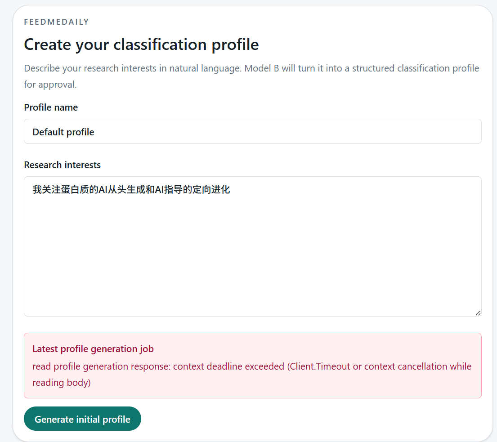
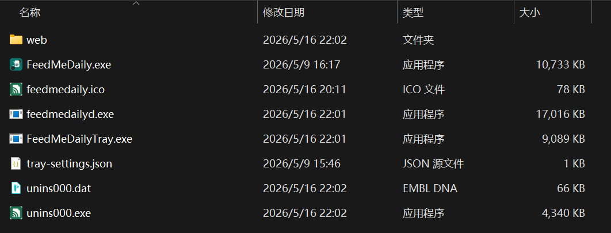

版本/分支：codex/go-feedmedailyd-skeleton

测试日期：2026-05-16

测试环境：source and release mode，Windows

1. 通过托盘打开服务会打开命令行，关闭命令行后后台服务也被关闭
2. Web UI的feed list输入框的URL输入框每次输入一个字母就会失去焦点
3. 需要一个比之前更加详细的日志系统，现在不对吧每个运行的命令、成功提示、错误信息写入日志
4. 上次的错误消息在网页刷新后还会被重新提示
5. cmd/feedmedailyd使用终端运行后没有任何信息输出
6. go run .\cmd\feedmedailyd --root .--report-latest运行后没有你说的reports/data/latest.json以及reports/latest/index.html文件。另外你检查一下这部分功能是不是已经弃用了，现在是纯数据库模式。我记得这是很久以前的功能
7. go run .\cmd\feedmedailyd --root .--run-once运行也没有任何进度提示，但是运行结果是对的。不过有一个小问题是{"fetched":463,"inserted":16,"updated":447,"classified":31,"errors":["http://www.cell.com/cell/current.rss: request failed with 403 Forbidden","https://chemrxiv.org/action/showFeed?type=latest\u0026format=rss: request failed with 403 Forbidden"],"report_path":"D:\\Codes\\Projects\\SciRSSAgent\\reports\\latest\\index.html"}
8. 之前的python版本添加elsevier来源的rss url后fetch后会报错list index out of range，现在go版本不会报错误了。之前的python版本无法获取nar的文献，现在的go版本没有问题了
9. 没找到你说的D:/Codes/Projects/SciRSSAgent/tray-settings.json文件
10. 网页图标和readme banner还是旧的logo
11. 初始化界面输入偏好后报错，并且会出现两个消息提示条，页面上方的提示条5s后消失，按钮上方的会保持
12. 
13. 安装后程序读取的current version是0.0.0，但安装包名称是0.1.3
14. 打开tray settings没反应
15. 从托盘程序点击open会闪过一个命令行
16. 安装后旧的主程序还在，卸载后旧python的tray-settings.json还在
