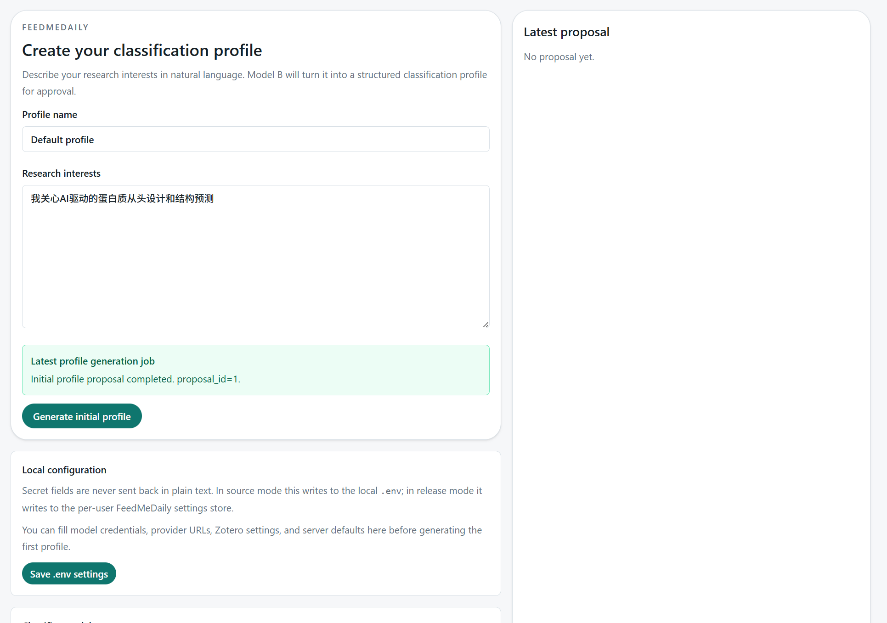

# FeedMeDaily v0.2.0 纯 UI 点击测试清单

测试目标：

- 只通过托盘和网页 UI 点击完成主流程验证
- 不依赖命令行、不直接调 API
- 覆盖你在 [docs/test-feedback.md](/D:/Codes/Projects/SciRSSAgent/docs/test-feedback.md) 里提到的问题，以及这轮新增修复点

建议测试环境：

- Windows 11
- 安装包构建产物或 source 模式都可
- 浏览器建议 Edge 或 Chrome

## 1. 启动与托盘

### 1.1 启动托盘

步骤：

1. 双击 `FeedMeDailyTray.exe`，或在 source 模式运行 tray 启动入口
2. 等待系统托盘出现 FeedMeDaily 图标

预期：

- 托盘图标出现
- 不应弹出或闪过命令行窗口


实际：

- 仍然会有命令行窗口闪烁

### 1.2 双击托盘打开应用

步骤：

1. 双击托盘图标

预期：

- 浏览器打开本地 FeedMeDaily 页面
- 如果后台未运行，tray 会自动带起后台服务
- 不应看到命令行闪过


实际:

- 可以打开，会闪烁

### 1.3 托盘右键菜单

步骤：

1. 右键托盘图标

预期：

- 看到这些菜单项：
  - `Open FeedMeDaily`
  - `Run Sync Now`
  - `Enable/Disable Daily Sync (...)`
  - `Launch At Login`
  - `Open Tray Settings`
  - `Open Data Folder`
  - `Open Logs Folder`
  - `Quit Tray And Stop Service`
- 不再出现单独的 `Start Background Service`
- 不再出现单独的 `Stop Background Service`
- 不再出现单独的 `Quit Tray`

实际：

正确

### 1.4 退出托盘

步骤：

1. 右键托盘图标
2. 点击 `Quit Tray And Stop Service`

预期：

- 托盘退出
- 后台服务一起退出
- 浏览器中的页面刷新后无法继续访问本地服务

实际：

- 正确

## 2. 首次打开与版本显示

### 2.1 页面首次打开

步骤：

1. 通过托盘点击 `Open FeedMeDaily`

预期：

- 页面能正常打开
- 图标、favicon、品牌资源都是新的 FeedMeDaily 版本

实际：

正确

### 2.2 版本号

步骤：

1. 打开 `Settings`
2. 进入 `Config` tab
3. 查看 `Release runtime` 或 `Update check` 区域

预期：

- 当前版本显示为 `0.2.0`
- 不应再显示 `0.0.0`

实际：

正确

## 3. Onboarding

### 3.1 生成初始 profile

前置：

- 当前没有 `classification_profile.json`

步骤：

1. 打开页面
2. 在 `Profile name` 输入任意名称
3. 在兴趣描述框输入一段研究兴趣
4. 点击 `Generate initial profile`

预期：

- 按钮进入运行态
- 页面内能看到 bootstrap job 状态
- 不应同时出现两条重复错误消息

实际：

- 消息提示正确，但成功generate后看不到新的Profile，需要手动刷新页面才会出现



### 3.2 bootstrap 失败提示

步骤：

1. 在 profile 模型配置不完整或故意制造失败的情况下重复 3.1

预期：

- 错误只在 onboarding 相关区域呈现
- 顶部不应再重复弹出同一条 bootstrap 错误

实际：

正确

## 4. Feed 初始化

### 4.1 添加 feed

步骤：

1. 点击 `Settings`
2. 进入 `Feeds`
3. 点击添加一条 feed
4. 在 `Journal` 和 `URL` 中逐字输入

预期：

- URL 输入框在连续输入时不失焦
- 每输入一个字符不会把焦点打断

实际：

正确

### 4.2 保存 feed

步骤：

1. 至少填入一条合法 feed
2. 点击保存
3. 刷新页面

预期：

- 保存成功
- 刷新后 feed 仍存在

实际：

正确

## 5. 定时同步

### 5.1 开启 daily sync

步骤：

1. 打开 `Settings`
2. 找到 `Scheduled sync`
3. 选择一个时间
4. 点击启用或更新按钮

预期：

- 页面显示 daily sync 已启用
- 文案应反映 tray-local daily sync，而不是 Windows Task Scheduler

实际：

正确

### 5.2 关闭 daily sync

步骤：

1. 点击禁用按钮

预期：

- 页面显示 disabled
- 刷新后状态保持一致

实际:

- 已复测，点击托盘菜单可以正常禁用
- 禁用后托盘未再出现卡死，左键双击和右键菜单都能继续响应

## 6. 手动运行与进度提示

### 6.1 托盘触发同步

步骤：

1. 右键托盘图标
2. 点击 `Run Sync Now`
3. 回到网页 UI

预期：

- Jobs 区出现新的 `run` job
- 进度文案依次出现：
  - `Fetching RSS feeds`
  - `Getting metadata`
  - `Classifying papers`
  - `Refreshing report from SQLite`

### 6.2 Admin 触发同步

步骤：

1. 打开 `Settings`
2. 在 `Config` tab 点击 `Sync now`

预期：

- Job 可以启动
- 完成后论文列表刷新
- 页面刷新后不会再次重复播报上一个 job 的完成或失败消息

实际：

可以，但正在运行的job比如正在fetch在刷新后看不到

## 7. 论文动作

### 7.1 Mark as read

步骤：

1. 在中间列表点开一篇论文
2. 在右侧点击 `Mark as read`

预期：

- 状态变更成功
- 切回 `Unread` 过滤时该论文消失

实际：

正确

### 7.2 Mark wrong

步骤：

1. 在右侧详情点击 `Mark wrong`
2. 选择新的 relevance
3. 输入 note
4. 提交

预期：

- 保存成功
- `Profile + Feedback` 区能看到该反馈

实际：

正确

### 7.3 Save to Zotero

前置：

- 已配置 Zotero

步骤：

1. 打开一篇已有分类结果的论文
2. 点击 `Save to Zotero`
3. 选择 collection
4. 点击保存

预期：

- 成功提示出现
- 按钮状态变为 `Saved`

实际：

正确

## 8. Proposal 流程

### 8.1 Generate proposal

前置：

- 已有 profile
- 已有 open feedback

步骤：

1. 打开 `Settings`
2. 进入 `Profile + Feedback`
3. 点击 `Generate profile proposal`

预期：

- 出现新的 proposal job
- 生成完成后 proposal 区刷新

### 8.2 Apply proposal

步骤：

1. 对 pending proposal 点击 `Apply`

预期：

- proposal 变为 `applied`
- 当前 profile 视图刷新
- 相关论文被重分类

### 8.3 Reject proposal

步骤：

1. 对 pending proposal 点击 `Reject`

预期：

- proposal 变为 `rejected`

## 9. 打开本地路径

### 9.1 Open Tray Settings

步骤：

1. 右键托盘图标
2. 点击 `Open Tray Settings`

预期：

- 系统正常打开 `tray-settings.json`
- 不再出现“点击没反应”

### 9.2 Open Data Folder / Open Logs Folder

步骤：

1. 分别点击 `Open Data Folder`
2. 分别点击 `Open Logs Folder`

预期：

- 资源管理器打开正确目录

## 10. 日志可读性

### 10.1 查看日志文件

步骤：

1. 通过托盘打开 `Open Logs Folder`
2. 打开当天的 `logs/YYYY-MM-DD.log`

预期：

- 日志是逐行文本格式，不是 JSONL
- 能看到：
  - feed 抓取请求
  - metadata enrichment
  - classifier batch
  - profile / zotero 请求
  - report refresh 摘要

## 11. 回归记录模板

```text
版本/分支：
测试日期：
测试环境：

1. 托盘启动：
2. 双击托盘打开应用：
3. 托盘菜单项结构：
4. 退出托盘并停止后台：
5. 页面打开与品牌资源：
6. 版本号显示：
7. onboarding：
8. feed 输入与保存：
9. daily sync：
10. run sync now：
11. mark as read：
12. mark wrong：
13. zotero save：
14. proposal generate/apply/reject：
15. tray settings / data folder / logs folder：
16. 日志可读性：

备注：
```
